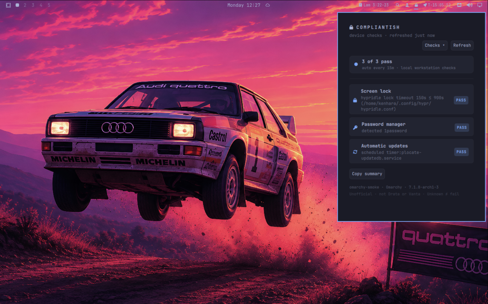

# Compliantish



Local workstation checks for Omarchy — **yes, the name is the joke.** Runs the
**union of Vanta + Drata workstation agent checks**: exactly **five** read-only
probes, a visible **Checks** menu, and a recurring local refresh. Native Omarchy
`bar-widget` (not Electron). No Drata/Vanta API; unofficial.

**ID:** `kenhara.compliantish`  
**Author:** Harris Kenny  
**License:** MIT  
**Version:** 0.5.17

### 0.5.17
- Header: FA lock glyph (`\uf023`) left of COMPLIANTISH; Checks + Refresh moved off the title row (full-width title plane).

### 0.5.15
- Checklist: tintable FA/Nerd glyphs per check (HD hdd / SL lock / AV shield / PW key / AU sync) replace `●`; status color tint kept. Body fontSize. Badges / Copy fix / bar chip unchanged.

### 0.5.14
- Bar urgent signal: FA lock `\uf023` (tintable) replaces color emoji 🔒 — WidgetButton `active` tints the chip with `bar.urgent` when any enabled check fails (not a toast). Unknown stays normal. Caption-sized glyph. Opt-in `notifyOnFail` desktop notify-send stays off by default.

### 0.5.13
- Bar chip: fixed 🔒 (no emoji swap); WidgetButton `active` → Omarchy urgent tint on real fail only (unknown stays normal).

### 0.5.12
- Panel shell: KeyboardPanel + PanelKeyCatcher (rocketlauncher oracle); CheckRow inlined as CheckRowDelegate (no qmldir sibling under Loader); toggle warns when panelLoader.item is null.

### 0.5.11
- F1: replace Style.font.title/subtitle with Style.font.body (oracle rocketlauncher tokens only) so panels load on VPS/smoke Omarchy.

### 0.5.10
- Remove Panel `import "."` (was shadowing qs.Ui Panel under Loader → dead bar clicks); CheckRow still via qmldir/module context.
- Bar chip: 🔒 when all enabled checks pass, else 🔓 — glyph only (fraction stays in tooltip).
- Tighter bar chip (`horizontalMargin` 6); denser Checks menu (body labels, spacing 6).

### 0.5.9
- Panel load failure: console.warn(moduleName + error) for journalctl; tooltip shows truncated error string (~120 chars).

### 0.5.8
- Panel `import "."` so Loader resolves CheckRow/sibling types; best-effort panel load error in tooltip.

### 0.5.5
- Renamed plugin id `harris.compliantish` → `kenhara.compliantish` (install path `~/.config/omarchy/plugins/kenhara.compliantish`). Display name unchanged.

### 0.5.4
- Discoverability: expanded `keywords` + `barWidget.aliases` (Drata/Vanta/SOC search terms); honest search note.

Changelog: [CHANGELOG.md](CHANGELOG.md) · Audit fixes: [AUDIT-NOTES.md](AUDIT-NOTES.md)

## Repository

**GitHub:** https://github.com/kenhara/omarchy-compliantish  
Local folder: **`omarchy-compliantish`**.

## Unofficial disclaimer

**Compliantish is unofficial.** It is **not** affiliated with, endorsed by,
or sponsored by Drata, Inc., Vanta, or any related entity. It mirrors common
workstation control *themes* only (disk encryption, screen lock, antivirus,
password manager, automatic updates). It does **not** sync to Drata or Vanta,
does **not** claim to satisfy any auditor, and must not be presented as an
official agent.

## What we check

The union of official agent lights is **exactly five** (firewall is **not**
included — it is not a first-class Drata agent / Vanta Device Monitor column):

| Key | Control | Vendors | Default | Omarchy probe (v1) |
|-----|---------|---------|---------|-------------------|
| HD | Hard drive encryption | Vanta + Drata | **on** | Real dm-crypt: `lsblk TYPE=crypt`, crypttab, or crypt in `/`/`/home` parent chain (not plain LVM mapper names) |
| SL | Screen lock | Vanta + Drata | **on** | `hypridle` / `swayidle` lock-bearing timeout ≤ `screenLockMaxSec` (default 900 = 15m, Drata Test 61) |
| AV | Antivirus | Vanta + Drata | **on** | Known packages / binaries / units (ClamAV, Falcon, SentinelOne, MDE, Sophos, …) |
| PW | Password manager | Vanta + Drata | **on** | 1Password, Bitwarden, KeePassXC, Proton Pass (pacman / bin / flatpak) |
| AU | Automatic updates | **Drata only** (not a first-class Vanta Device Monitor column) | **on** | Genuinely scheduled update timers (`is-active` or `enabled`/`enabled-runtime`) — else Unknown |

Keys (`HD`/`SL`/…) are **internal JSON** only — the UI shows full names and a
colored `●` status dot (pass = accent, fail = urgent, unknown = muted amber).

**Unknown ≠ fail.** Missing tools or inconclusive signals stay amber, never silent red.

Disabled checks still appear in the **Checks** menu as Off; they are **not
listed** in the main checklist and **not counted** toward `pass/total` on the bar.

Probes are **read-only**, **offline**, and never auto-sudo. Remediation is
**Copy fix** / **Open config** (screen lock) / **Refresh** / **Copy summary** only.

## Discoverability

Marketplace filing: **System** · tags `bar, security, quickshell` (suggest
missing tag: `compliance`).

Top-level `keywords` in `manifest.json` may help marketplace/search (Drata,
Vanta, SOC 2, disk encryption, ClamAV, 1Password, etc.). `barWidget.aliases`
are for discovery docs and human search — the bar loader may not index them.
Display name stays **Compliantish** (owned joke; no vendor as title).
Workstation probes only — not a full SOC/HIPAA certification agent.

## Install

### From GitHub

```sh
omarchy plugin add https://github.com/kenhara/omarchy-compliantish.git --enable
omarchy bar move kenhara.compliantish --section right
```

### Local copy (this tree)

The **git repo root is the plugin** (`manifest.json` at root). On an Omarchy
machine:

```sh
# From a clone of this repo (repo root = plugin root)
mkdir -p ~/.config/omarchy/plugins
cp -a . ~/.config/omarchy/plugins/kenhara.compliantish

omarchy plugin validate ~/.config/omarchy/plugins/kenhara.compliantish
omarchy-shell shell rescanPlugins

omarchy bar move kenhara.compliantish --section right
```

Hot reload applies on save under `~/.config/omarchy/plugins/`.

### Symlink (dev)

```sh
mkdir -p ~/.config/omarchy/plugins
ln -sfn /path/to/omarchy-compliantish ~/.config/omarchy/plugins/kenhara.compliantish
omarchy-shell shell rescanPlugins
```

## Usage

- **Left-click** the bar lock chip to open/close the panel (urgent/red tint when any enabled check fails; hover tooltip shows pass fraction).
- **Middle-click** re-runs `scripts/probe.sh`.
- **Right-click** closes the panel.
- In the panel header: **Checks** opens the enable/disable menu for all five;
  **Refresh** re-runs the probe. Summary shows `auto every 15m` (or your interval).
- Per-row **Copy fix** / **Open config** (screen lock), plus **Copy summary**.
- Pointer cursor only on actionable controls.

### Controls

| Input | Action |
|-------|--------|
| Left-click bar | Toggle panel |
| Middle-click bar | Refresh probe |
| Right-click bar | Close panel |
| Checks | Open/close enable/disable menu for HD/SL/AV/PW/AU |
| Refresh | Re-run `scripts/probe.sh` |
| Copy fix | Clipboard the suggested one-liner (when present) |
| Open config | `xdg-open` on detected `hypridle.conf` (screen lock) |
| Copy summary | Clipboard markdown of enabled statuses + host meta |

### Recurring refresh

`ComplianceStore` keeps a repeating Timer. Default `refreshIntervalSec` = **900**
(15 minutes). The interval syncs from widget settings; the panel subtitle shows
`auto every Xm`. Opening the panel also refreshes. Official Drata agent sync is
~daily — this timer only re-probes **locally**.

### IPC

```sh
omarchy-shell shell toggle kenhara.compliantish
omarchy-shell shell hide kenhara.compliantish
```

Optional summon (best-effort): handlers accept `{"refresh":true}` /
`{"copySummary":true}` when a payload arrives. Omarchy `shell summon` for
**bar-widget-only** plugins may drop the payload and only open the widget —
do not rely on summon as a public API.

## Configure

| Key | Type | Default | Description |
|-----|------|---------|-------------|
| `refreshIntervalSec` | integer | `900` | Local probe interval (min 60). Shown as `auto every Xm`. |
| `screenLockMaxSec` | integer | `900` | Screen lock passes when idle→lock timeout ≤ this many seconds (Drata ≤15m; raise to 3600 for Vanta-only). |
| `notifyOnFail` | bool | `false` | Opt-in desktop `notify-send` once per enabled check per day on transition to fail. Separate from the bar urgent chip tint; off by default. |
| `enableDiskEncryption` | bool | `true` | Include HD encryption (also toggled in **Checks** menu). |
| `enableScreenLock` | bool | `true` | Include screen lock (also **Checks** menu). |
| `enableAntivirus` | bool | `true` | Include antivirus (also **Checks** menu). |
| `enablePasswordManager` | bool | `true` | Include password manager (also **Checks** menu). |
| `enableAutoUpdates` | bool | `true` | Include automatic updates (also **Checks** menu). |

## Remove

```sh
omarchy plugin remove kenhara.compliantish
```

Optional cache cleanup:

```sh
rm -rf ~/.cache/compliantish
```

## Network

**None in v1.** All checks are local shell probes. Cache:
`~/.cache/compliantish/last.json`.

## Layout

```
manifest.json          plugin manifest (id kenhara.compliantish)
BarWidget.qml          bar entry + Loader → Panel
Panel.qml              Checks menu + checklist + Tier A actions
CheckRow.qml           reference row UI (Panel inlines CheckRowDelegate)
ComplianceStore.qml    Process → scripts/probe.sh + cache + enable filters + Timer
qmldir
scripts/probe.sh       JSON on stdout (always five checks)
LICENSE                MIT
README.md
CHANGELOG.md
AUDIT-NOTES.md
preview.svg
preview.png
REPO.md
DESIGN.md
PRE-SHIP.md
docs/preview/          HTML mock
```

## Security baseline

- Read-only probes; remediation is user-triggered copy/open only.
- No Drata/Vanta credentials, no OSQuery dependency, no auto package install.
- MIT at repo root.

## License

MIT — see [LICENSE](LICENSE).
